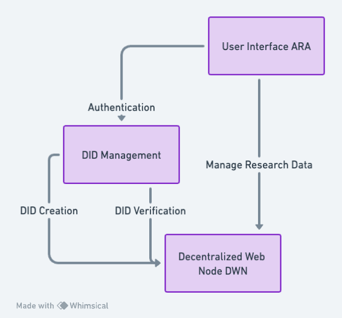

# The Alamos Research App

The Alamos Research App, aka The ARA, allows scientists collaborate and manage sensitive research related to the creation of the first atomic bomb.

I was inspired after watching the movie Oppenheimer which was 3 hours of character development and 5 minutes of the actual bomb being dropped.

I thought, "What if there was an app that could help the scientists collaborate and manage their research in a decentralized manner since identity verification was so important for them?".

And thus, the ARA was born.

## Getting Started

This is a [Next.js](https://nextjs.org/) project bootstrapped with [`create-next-app`](https://github.com/vercel/next.js/tree/canary/packages/create-next-app).

First, run the development server:

```bash
npm run dev
```

Open [http://localhost:3000](http://localhost:3000) with your browser to see the result.

## Deployed URL

https://ara.vercel.app

## Overview

The Alamo Research App leverages decentralized technologies to provide a secure and collaborative environment for scientists.

By using DIDs, decentralized storage, encrypted communication, and specialized collaboration protocols, ARA ensures that sensitive research data is handled with the utmost confidentiality and integrity.

It's a comprehensive solution that addresses the unique challenges of managing highly sensitive and collaborative research projects.



### User Interface (UI)

- Access Point: Scientists access the ARA through a user interface that provides tools for collaboration, data management, and secure communication.
- Authentication: Users are authenticated through Decentralized Identifiers (DIDs), ensuring a secure and privacy-preserving login process.

### DID Management

- DID Creation: New users create a DID, which serves as a decentralized identity within the system.
- DID Verification: Existing users' DIDs are verified to ensure that only authorized individuals can access the system.

### Decentralized Web Node (DWN)

- Data Storage: All data, including research documents and collaboration details, are stored in decentralized web nodes (DWNs).
- (NOT SURE YET) Data Encryption: Data is encrypted and securely stored to ensure that only authorized individuals can access it.
- (NOT SURE YET) Syncing: Data is synced across different DWNs to ensure availability and redundancy.

## Logistics

I started working on this at 9 am on Wednesday, August 9th.

I spent the first hour:

- brainstorming and deciding on an idea
- creating the basic system design diagram using Whimsical
- creating a basic landing page using some design inspiration from TBD's website
- committing this initial scaffold and deploying it to Vercel

I plan to spend the next 2 hours building the UI and decentralized architecture.

## Resources

- [TBD Quickstart](https://developer.tbd.website/docs/web5/quickstart)
